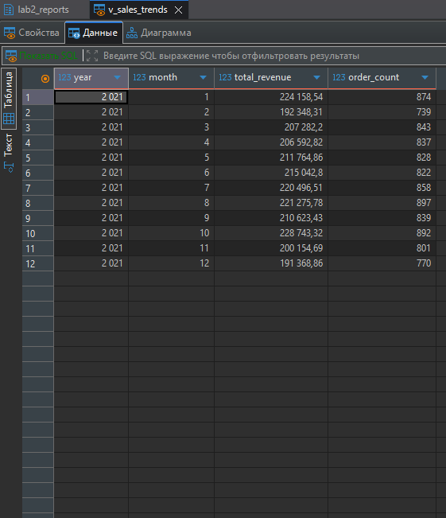
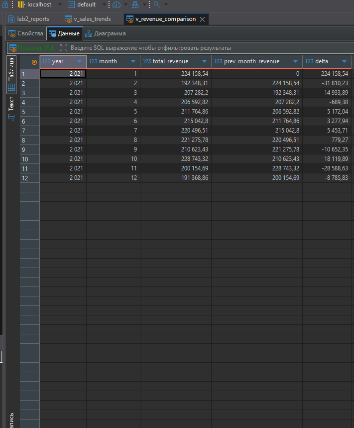

# BigDataSpark

Команды необходимо выполнять поочередно (нельзя сделать витрины без снежинок).
Первым делом необходимо запустить контейнеры: ```docker compose up```

## Снежинка postgresql
Запускает джобу для создания снежинки.  
Можно добавить вместо PGSql YDB.    


## Отчеты clickhouse
Изначально через SQL создается схема. Она включает в себя:  
- БД с отчетами, в которой: 
- - 6 витрин-отчетов с данными  
- - 18 view, которые собирают и выводят выборку для решения [задания](./ZADANIE.md)
  
БД используют движок Atomic, таблицы - MergeTree.   
Для работы со Spark необходим clickhouse-connector и postgresql-jdbs  



